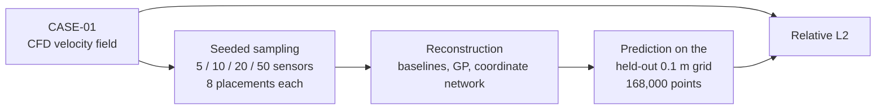
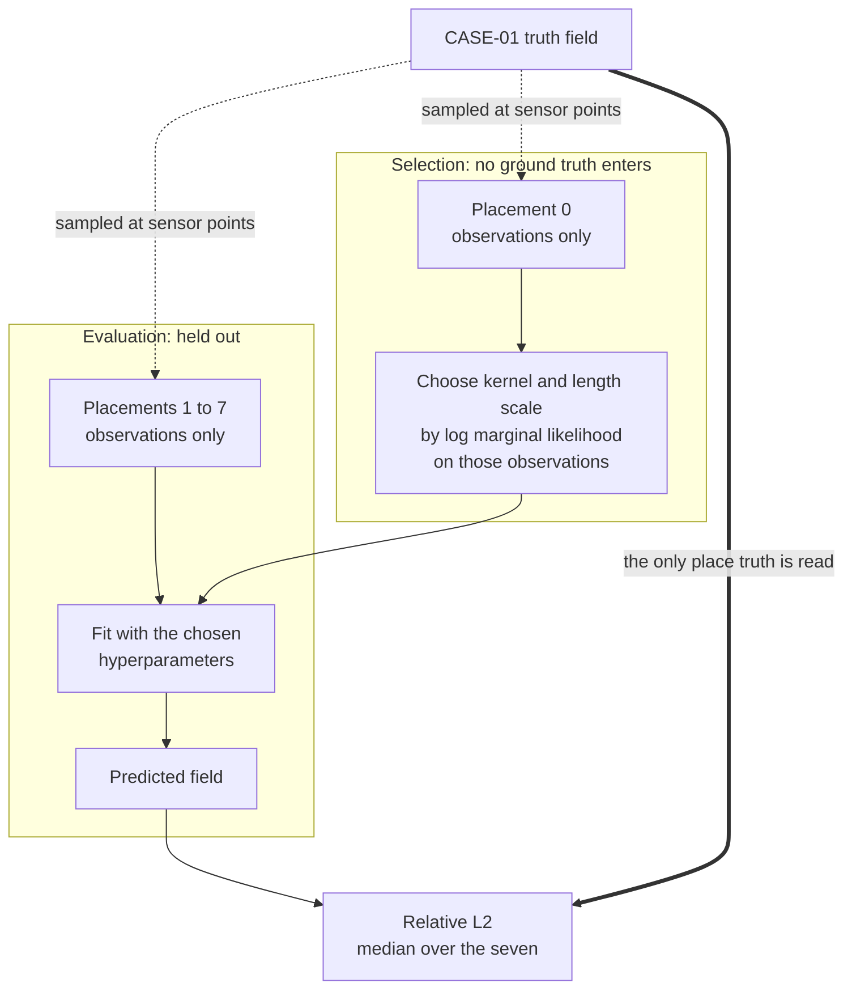
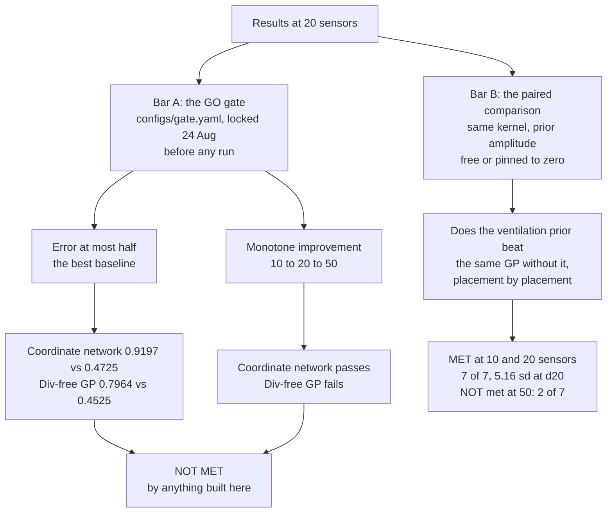
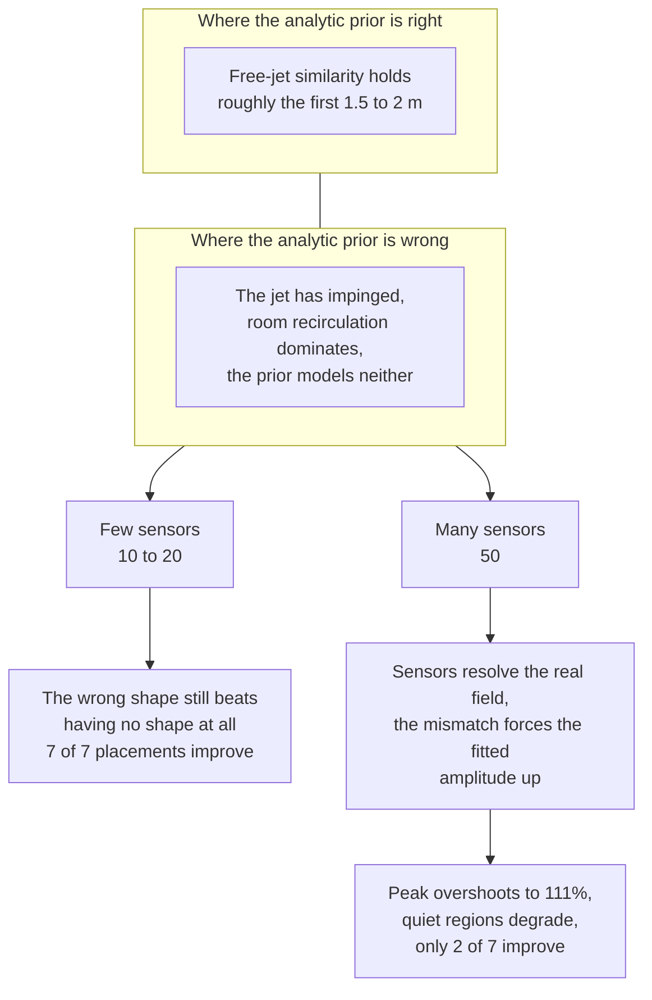

# Open AirField

How well can the airflow in a room be reconstructed from a handful of point
measurements?

Open AirField is a benchmark for that question. It takes a CFD velocity field
from a mechanically ventilated room, samples it at 5, 10, 20 and 50 simulated
sensor positions, and scores reconstruction methods against the full field they
never see. The reconstructors range from deliberately dumb baselines to a
physics-constrained coordinate network and a divergence-free Gaussian process.

The result the benchmark exists to test: **a Gaussian process given the room's
declared ventilation condition as its prior mean beats the same Gaussian process
without it, at 10 and 20 sensors, on every held-out placement.** At 50 sensors
the advantage reverses.

## Status

This repository is complete and the results below are reproducible from it end to
end. The ground-truth field is deposited and citable at
[10.5281/zenodo.22670840](https://doi.org/10.5281/zenodo.22670840) under CC BY 4.0;
see [Getting the data](#getting-the-data). Everything else, including every number
on this page, is produced by a script in `scripts/`.

## The case

CASE-01 is a steady RANS solution for an unobstructed 8 x 7 x 3 m room, computed
in OpenFOAM (`simpleFoam`, k-omega SST) by Nishan Jain of AeroSHILA, and declared
in full before any reconstruction work began.

| | |
|---|---|
| Domain | 8.0 x 7.0 x 3.0 m, origin at a floor corner, z upwards |
| Supply | plain 0.6 x 0.6 m ceiling opening at (4.0, 1.5, 3.0), 1.0 m/s downward |
| Extract | plain 0.6 x 0.6 m ceiling opening at (4.0, 5.5, 3.0), 0.36 m³/s |
| Solver | `simpleFoam`, incompressible, isothermal, no buoyancy |
| Peak speed in field | 1.0707 m/s |

Two differences between the case as declared and the case as run are recorded by
the author and carried in `src/open_airfield/geometry.py`: the near-wall mesh was
run flat at the 0.05 m base resolution rather than graded, and the openings are
plain rectangular patches rather than diffusers with vanes. The second one
constrains what may be claimed, so it is in the type name (`CeilingPatch`) as
well as this file.

## Method

Sparse reconstruction of a velocity field is badly under-determined: twenty
three-component readings in a 168 m³ room leave almost everything unconstrained.
The usual fix is to add physics. This benchmark separates two ways of doing that
and measures them against each other.



**Divergence-free by construction.** Every field the Gaussian process produces is
built from a vector stream function, so it is exactly solenoidal rather than
approximately so. There is no penalty term to weight and no residual to
converge. For this case that is exact rather than approximate, and the
justification is the solver rather than an appeal to first principles:
`simpleFoam` enforces div(U) = 0 directly, with no energy equation, no buoyancy
and no compressibility, and the global continuity residual at convergence was of
order 1e-9.

**The declared ventilation condition as a prior mean.** Instead of centring the
Gaussian process on zero, it is centred on an analytic field built only from the
supply and extract geometry and the declared flow rate: a round free jet with a
Gaussian radial profile, half-width growing at 0.082·s, centreline decaying to
conserve momentum, and a weak short-reach sink at the extract. The jet is
expressed through Stokes stream functions, so the prior is divergence-free too.
Nothing in the prior is fitted to the sensor data. Its one free parameter is a
scalar amplitude, and even that is selected without touching the field being
scored.

The comparison is deliberately narrow. Both arms of the headline pair use the
same kernel and the same length scale, selected together from the same family.
The only thing that differs is whether the prior amplitude is free or pinned to
zero. That makes it a test of the ventilation prior itself rather than a test of
two different models.

The coordinate network (`src/open_airfield/model.py`) is a separate arm: an MLP
mapping (x, y, z) to (u, v, w, p) under continuity and boundary losses. It is
measured here, not promoted.

## Protocol

Locked before the runs, and stated here because a selection rule chosen after
seeing results is not a selection rule.

- Eight sensor placements per density, drawn uniformly at random, inset 0.1 m
  from the walls. Seed law: `seed = 1000 * density + placement_id`, so density
  20 placement 3 is seed 20003 and the same seed gives byte-identical
  observations.
- Hyperparameters are selected on placement 0 alone, **by log marginal
  likelihood on the observations only**. No evaluation-grid truth reaches the
  selection at any point.
- Results are the median over the seven held-out placements, 1 to 7.
- Evaluation is on a fixed held-out grid: cell-centred, 0.1 m, 80 x 70 x 30 =
  168,000 points, cached per truth field.
- Error is relative L2 over the whole field. 1.0 is what predicting zero
  everywhere scores.

Ground truth is read in exactly one place, and it is not the place where any
choice is made.



The selection rule is stricter than the protocol required, and it matters. An
earlier selector scored candidates against ground truth on placement 0, which
inflated some methods and deflated others. Every number here comes from the
observations-only selector.

## Results

Median relative L2 over held-out placements 1 to 7. Lower is better.

| Reconstructor | 10 sensors | 20 sensors | 50 sensors |
|---|---|---|---|
| Zero field | 1.0000 | 1.0000 | 1.0000 |
| Field mean | 1.0186 | 1.0027 | 1.0105 |
| Inverse distance weighting | 0.9775 | 0.9460 | 0.8798 |
| Componentwise GP (ordinary kriging) | 0.9505 | 0.9051 | 0.8687 |
| Coordinate network (PINN) | | 0.9197 | |
| Analytic prior alone, no sensors | 0.8763 | 0.8763 | 0.8763 |
| Divergence-free GP, no prior | 0.9211 | 0.8634 | 0.7836 |
| **Divergence-free GP + ventilation prior** | **0.8310** | **0.7964** | 0.8188 |

The row worth pausing on is the analytic prior with no sensors at all. Geometry
alone, with no measurement, reconstructs this room better than inverse distance
weighting does from twenty readings.

The three rows that carry the result, with the baselines dropped so the shape is
visible. Bars are scaled from 0.75 to 0.95.

```text
                          0.75     0.80     0.85     0.90     0.95
                            |        |        |        |        |
  10 sensors
    prior alone, no sensors ████████████████████████████                 0.8763
    GP, no prior            ██████████████████████████████████████       0.9211
    GP + ventilation prior  ██████████████████                           0.8310  <-- best

  20 sensors
    prior alone, no sensors ████████████████████████████                 0.8763
    GP, no prior            █████████████████████████                    0.8634
    GP + ventilation prior  ██████████                                   0.7964  <-- best

  50 sensors
    prior alone, no sensors ████████████████████████████                 0.8763
    GP, no prior            ███████                                      0.7836
    GP + ventilation prior  ███████████████                              0.8188  <-- prior now hurts
```

### Two different bars, and only one is met

The repository contains a pre-registered pass condition in `configs/gate.yaml`,
committed on 24 August 2026 before any run. It requires the model to reach half
the error of the best baseline at 20 sensors, and to improve monotonically from
10 to 20 to 50.

**Nothing built here meets it.** The coordinate network scores 0.9197 against a
threshold of 0.4725 and passes the monotonicity clause. The divergence-free GP
with the ventilation prior scores 0.7964 against a threshold of 0.4525 and fails
monotonicity. A halving of error against the best baseline was an ambitious bar
and it was not cleared. It is stated here rather than quietly retired.

The two bars, and what each one actually asks:



Said plainly: an unqualified claim to have "cleared the pre-registered bar" reads
as Bar A, and would be false.

The bar that **is** met is a different and narrower one: the paired comparison
between the two arms of the nested pair, on the same seven held-out placements.

| Sensors | No prior | With prior | Placements improved | Effect size | Peak speed recovered |
|---|---|---|---|---|---|
| 10 | 0.9211 | 0.8310 | 7 of 7 | 8.92 sd | 45.5% |
| 20 | 0.8634 | 0.7964 | 7 of 7 | 5.16 sd | 45.6% |
| 50 | 0.7836 | 0.8188 | 2 of 7 | −0.17 sd | 110.7% |

So: the ventilation prior helps decisively at 10 and 20 sensors, on every
placement, under a selector that never sees the answer. At 50 it stops helping
and starts hurting.

### Why it reverses

The reversal is a physical effect rather than a fitting artefact, and the
explanation belongs to the author of the CFD case rather than to us. Free-jet
similarity holds for roughly the first 1.5 to 2 m of the 3 m drop. Below that the
jet has impinged, room recirculation dominates, and the analytic prior has the
wrong shape. At low sensor counts that wrong shape is still worth more than
nothing. Once there are enough sensors to resolve the real field, the mismatch
forces the fitted amplitude up, the peak overshoots to 111% of truth, and the
quiet parts of the room pay for it.



Two qualifications on that, both from Nishan Jain:

- **The crossover is not at 50 sensors.** It is not a fixed number at all. It
  scales with the throw-to-height ratio and moves with room geometry. Fifty is
  where it falls in this room, not a property of the method.
- **The 88% peak from the prior alone flatters the model.** That peak happens to
  sit at the extract lip, where the jet model is most accurate. Had it fallen in
  the impingement zone the figure would be considerably worse.

## What this does not show

- **Peak speeds are under-predicted by more than half at 10 and 20 sensors**
  (45.5% and 45.6% of the 1.0707 m/s truth). The jet core is narrow and
  high-gradient, and randomly placed sensors rarely land in it. Capturing bulk
  room flow while missing peaks is the expected failure mode of sparse
  reconstruction, not a defect of this implementation, but it does bound what the
  reconstruction may be used for.
- **The jet model is bounded to the first 1.5 to 2 m.** Beyond that, treat it as
  a prior that is convenient rather than correct. The near-field profile is not
  Gaussian, since there is a potential core, and the square opening introduces
  corner flows that a round model does not represent.
- **The extract is not a mirror of the supply.** It is modelled as a weak sink
  with about a 1 m reach. A jet carries momentum and stays coherent; an extract
  influences a far smaller region and its decay is much steeper. The simple model
  is adequate because the extract contributes little to the field, but describing
  it as a mirror overstates its reach and its symmetry.
- **One room, one flow condition, no obstructions.** The room is empty. Furniture,
  partitions and more complex ventilation layouts are outside what a single
  analytic jet can stand in for, and better analytical treatments exist for them.
- **Steady state only.** No transients, no thermal drive, no contaminant
  transport.

## Reproducing this

### Getting the data

The CFD field is not in this repository. It is a 207 MB export and `data/` is
git-ignored.

It is deposited on Zenodo under CC BY 4.0:

> **DOI [10.5281/zenodo.22670840](https://doi.org/10.5281/zenodo.22670840)**

Download `internal_00010000.vtu`, `internal_00010000.vtk` and `meta.yml` from the
record, verify them against the `SHA256SUMS.txt` published alongside them, then lay
them out so the paths below resolve:

```
data/case-01/meta.yml
data/case-01/data/internal_00010000.vtu
data/case-01/data/internal_00010000.vtk
```

The record also carries the author's QA report and four velocity-magnitude renders
of the case. Neither is needed to run the benchmark.

The case was computed by Nishan Jain (AeroSHILA). Vench Creative Ltd is the rights
holder, dataset licensor and commissioning body; Nishan Jain is credited for the
CFD modelling and physics validation.

### Running it

```sh
uv sync
uv run pytest                       # 53 tests, no CFD data required
```

The test suite runs against a closed-form divergence-free synthetic field
(`src/open_airfield/field_synthetic.py`), which is why it passes without the
case data.

With the CASE-01 export in place:

```sh
# The headline fit and the paired comparison.
uv run python scripts/p1_gp_fit.py \
  --vtk data/case-01/data/internal_00010000.vtu \
  --out outputs/<date>-gp

# Does the peak gap close as sensors are added?
uv run python scripts/p4_peak_density_diagnostic.py \
  --vtk data/case-01/data/internal_00010000.vtu

# Every reconstructor against every density and placement.
uv run python scripts/u6_gate_report.py

# A single coordinate-network fit.
uv run python scripts/u4_train.py
```

Python 3.12, matching the training container. First run builds and caches the
evaluation grid and the observation sets, which takes a few minutes; later runs
reuse them.

Historical outputs are kept under `outputs/` and dated. `outputs/2026-09-01-gp/`
predates the selector correction described under [Protocol](#protocol) and is
retained as a record of what was claimed at the time. **Its numbers are
superseded and should not be cited.**

## Layout

```
src/open_airfield/
  jet_prior.py        analytic divergence-free ventilation prior
  baselines.py        zero, mean, IDW, standard GP, divergence-free GP
  model.py            physics-constrained coordinate network
  sampling.py         seeded observation sets and the held-out evaluation grid
  metrics.py          relative L2 and per-run evaluation
  geometry.py         CASE-01 room and declared flow condition
  ingest_vtk.py       VTK export to truth field
  field_synthetic.py  closed-form field for the test suite
  gate.py             sweep runner and report
  contracts.py        shared types
configs/gate.yaml     the pre-registered pass condition
scripts/              runnable entry points
tests/                53 tests
```

## Citing the case

The CFD case is Nishan Jain's work and should be credited as such in anything that
uses it. This repository covers the reconstruction and the benchmark around it, not
the simulation.

Cite the dataset as:

```
Jain, N. (2026). Open AirField CASE-01: steady RANS velocity field for a
mechanically ventilated room (1.0.0) [Data set]. Zenodo.
https://doi.org/10.5281/zenodo.22670840
```

The dataset's own minimum credit line, which travels with it:

> Rights holder and dataset licensor: Vench Creative Ltd.
> CFD modelling and physics validation: Nishan Jain.
> Commissioned by Vench Creative Ltd for the Open AirField project.
> Licence: Creative Commons Attribution 4.0 International (CC BY 4.0).

## Licence

Apache License 2.0. Copyright Vench Creative Ltd. See [LICENSE](LICENSE).
